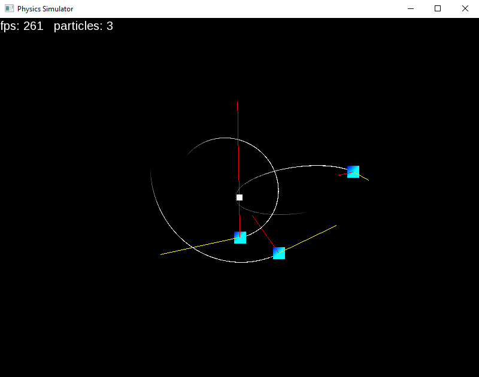

# Physics Simulator

This is a little project I'm working on to learn c++, physics and in general to expand my brain and make something cool on the way.

This repository was created using the [CMake SFML Project Template](https://github.com/SFML/cmake-sfml-project).

## Images




## Explanation and controls

Current version simulates gravitational force exerted from a single point.

Click or drag to create particles. Right click to remove them.

The red lines show the acceleration of the particles and the yellow lines show the velocity.

## How to download

Go to [Releases](https://github.com/CoderXam/PhysicsSimulator/releases/) and download any zipped file from the list.
 
## Building the project yourself using cmake

1. You will need:
- CMake
- Something to build executables (example: GNU Make or MinGW Make)
- Something to compile c++ code (example: gcc/g++)

1. Most popular IDEs support CMake projects with very little effort on your part.
    - [VS Code](https://code.visualstudio.com) via the [CMake extension](https://code.visualstudio.com/docs/cpp/cmake-linux)
    - [Visual Studio](https://docs.microsoft.com/en-us/cpp/build/cmake-projects-in-visual-studio?view=msvc-170)
    - [CLion](https://www.jetbrains.com/clion/features/cmake-support.html)
    - [Qt Creator](https://doc.qt.io/qtcreator/creator-project-cmake.html)
  
1. Using CMake from the command line is straightforward as well. To generate the build system:
    ```
    cmake -S . -B build -G <generator-name>
    ```

    If no generator is specified cmake will choose a default (Use `cmake --help` to see the list of generators).

    Once the files have been generated you can then run Make or use the command
    ```
    cmake --build build
    ```

    If you want to make any changes to existing source files, save the files then do `cmake --build` command again to rebuild the project. No need to recreate the makefiles (or equivalent).

1. If you use Linux, install SFML's dependencies using your system package manager. On Ubuntu and other Debian-based distributions you can use the following commands:
    ```
    sudo apt update
    sudo apt install \
        libxrandr-dev \
        libxcursor-dev \
        libudev-dev \
        libfreetype-dev \
        libopenal-dev \
        libflac-dev \
        libvorbis-dev \
        libgl1-mesa-dev \
        libegl1-mesa-dev
    ```
1. Not sure how to properly set up for debug and release modes yet. I think it builds in release by default.

## Resources

Some resources that helped me out for this project:

Low Level Game Dev: https://www.youtube.com/@lowlevelgamedev9330 (c++, game dev, inspiration)

The Cherno: https://www.youtube.com/watch?v=18c3MTX0PK0&list=PLlrATfBNZ98dudnM48yfGUldqGD0S4FFb (c++ content and tutorials)

Code, Tech, and Tutorials: https://www.youtube.com/@CodeTechandTutorials (c++ and cmake tutorials)

SFML: https://www.sfml-dev.org/learn.php (sfml help and tutorials)

This guy is also cool (javidx9/One Lone Coder): https://www.youtube.com/@javidx9

Desmos is always good for general math and finding the right math functions https://www.desmos.com/calculator

Of course Stack Overflow and ChatGPT have also been good help for this project as well as other random forums and stack exchanges. 

## License

The source code is dual licensed under Public Domain and MIT -- choose whichever you prefer.