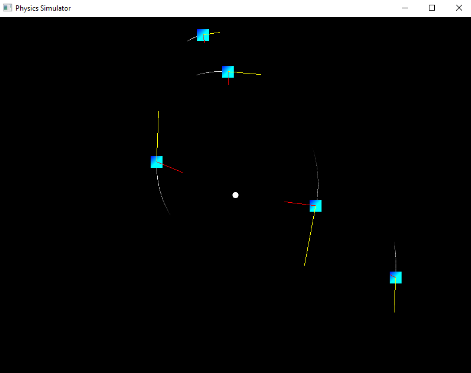
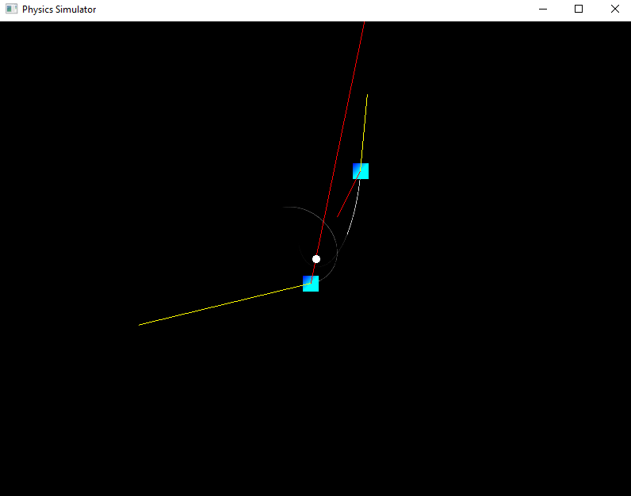

# Physics Simulator

This is a little project I'm working on to learn c++, physics and in general to expand my brain and make something cool on the way.

This repository was created using the [CMake SFML Project Template](https://github.com/SFML/cmake-sfml-project).

## Images





## Explanation and controls

Current version simulates gravitational force exerted from a single point.

Click or drag to create particles. Right click to remove them.

The red lines show the acceleration of the particles and the yellow lines show the velocity.

## How to download

Go to [Releases](https://github.com/CoderXam/PhysicsSimulator/releases/) and download any zipped file from the list.
 
## Building the project yourself using cmake

1. You will need:
- CMake
- Something to build executables (example: GNU make)
- Something to compile c++ code (example: g++)

1. If you want to add or remove any .cpp files, open [CMakeLists.txt](CMakeLists.txt) and change the source files listed in the [`add_executable`](CMakeLists.txt#L10) call in CMakeLists.txt to match the source files your project requires.
1. Type the following commands while in the project source directory, note that if a build system generator is not specified cmake will use the default generator.

    For a single-configuration generator (typically the case on Linux and macOS):
    ```
    cmake -S . -B build -G <generator-name> -DCMAKE_BUILD_TYPE=Release
    cmake --build build
    ```

    For a multi-configuration generator (typically the case on Windows):
    ```
    cmake -S . -B build -G <generator-name>
    cmake --build build --config Release
    ```

    For help using cmake:
    ```
    cmake --help
    ```
1. If you want to make any changes to existing source files, save the files then enter the --build command again to rebuild the project.
1. The executable will be created somewhere in the build directory.

## License

The source code is dual licensed under Public Domain and MIT -- choose whichever you prefer.
